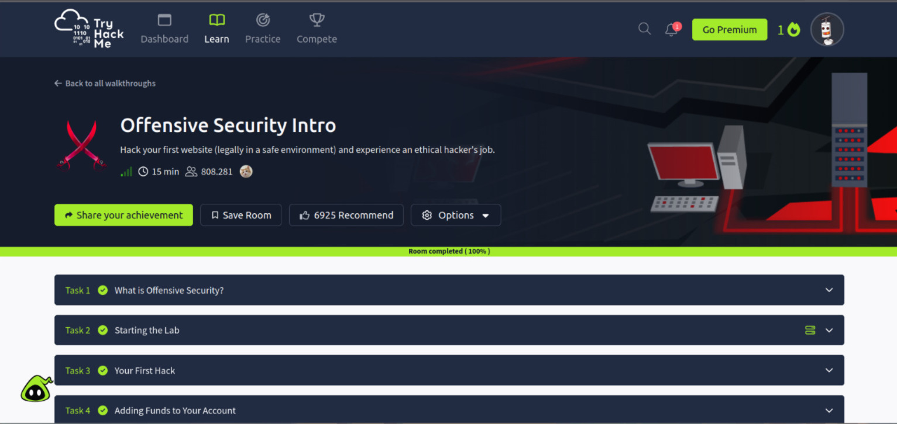

# TryHackMe-Offensive-security-intro
Registro prático dos conhecimentos obtidos neste laboratório da plataforma TryHackMe

## Objetivos do Laboratório
Explorar conceitos iniciais de segurança ofensiva em um ambiente controlado, simulando um ataque a uma aplicação vulnerável.

## O que aprendi
- Uso prático da ferramenta 'dirb' para enumeração de diretórios no domínio da aplicação;
- Identificação de um subdiretório sensível que permitiu acesso a funcionalidades administrativas;
- Exploração da falha para realizar ações não autorizadas dentro da aplicação, como a transferência de valores

## Conclusão
O laboratório permitiu aplicar na prática técnicas de enumeração e exploração de vulnerabilidades em uma aplicação web, reforçando conceitos de segurança aprendidos.
